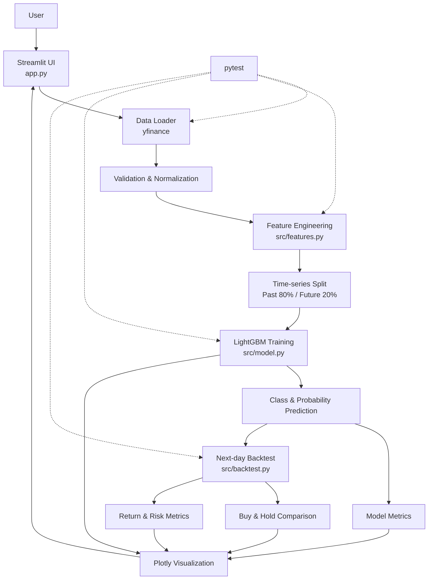

# Stock Analysis Dashboard

株価データの取得、特徴量生成、LightGBMによる翌営業日の方向予測、時系列評価、バックテストまでをブラウザ上で実行できるStreamlitアプリです。

就職活動用のポートフォリオとして、データ処理、機械学習、時系列データの評価、Web UI、自動テスト、設計文書を一つのプロジェクトにまとめています。

> [!WARNING]
> 本プロジェクトは学習・情報提供を目的としています。投資判断を推奨・保証するものではなく、過去の評価結果は将来の価格変動や利益を保証しません。

## Project Overview

ユーザーが銘柄コード、取得期間、Buy判定の確率閾値を入力すると、以下の処理を順番に実行します。

1. Yahoo Financeから日足株価を取得
2. 当日までの情報だけを使って特徴量を生成
3. 翌営業日の終値が上昇したかを目的変数として作成
4. 過去80%を学習、未来20%をテストとして時系列分割
5. LightGBMで上昇・非上昇を分類
6. 分類指標と特徴量重要度を計算
7. 予測確率からBuy/Cashシグナルを生成
8. 翌営業日執行のバックテストをBuy & Holdと比較

ランダム分割は使用せず、未来のデータが過去の学習へ混入しない設計を重視しています。

## Features

### Interactive dashboard

- 銘柄コード入力（デフォルト: `7203.T`）
- 取得期間入力（デフォルト: `1y`）
- Buy閾値入力（デフォルト: `0.55`）
- 処理段階ごとのローディング表示とエラーメッセージ

### Data and feature engineering

- yfinanceによる日足株価取得
- yfinanceのMultiIndex列への対応
- Daily Return、5日リターン、20日リターン
- MA5、MA20、MA50、MA20乖離率
- 20日ボラティリティ、出来高変化率
- 14日RSI（Wilder方式の指数平滑）
- EMA12、EMA26、MACD、Signal、Histogram
- Bollinger Bands（20日・2σ）、Band Width、%B
- 翌営業日の上昇を表すTarget
- 欠損値・無限値・列不足・空データの検証

### Machine learning

- 日付昇順を維持した80% / 20%の時系列分割
- `LGBMClassifier`による二値分類
- 上昇クラス1の予測確率
- Accuracy、Precision、Recall、F1、ROC-AUC
- Gain Importance（分岐による損失関数の改善量）
- Split Importance（木の分岐に使われた回数）
- 固定した`random_state`による再現性

### Backtesting

- 予測確率が閾値以上ならBuy、それ以外はCash
- シグナルは予測日の翌営業日から執行
- 次のシグナルまで直前のポジションを維持
- StrategyとBuy & Holdの同期間比較
- Total Return、Annual Return、Annual Volatility
- Sharpe Ratio、Max Drawdown
- Win Rate、Average Gain、Average Loss、Total Trades

現時点ではショート、取引手数料、税金、スリッページを考慮していません。

特徴量重要度はモデル内での利用状況を表すもので、因果関係を示しません。相関した特徴量間では重要度が分散する可能性があるため、単一の学習期間における重要度だけで特徴量の削除を判断しない方針です。

### Visualization

- 株価、20日移動平均線、50日移動平均線
- Gain / Splitを切り替えられるFeature Importanceグラフと一覧表
- Gain上位5特徴量と、Gain・Splitそれぞれの重要度が0の特徴量数
- StrategyとBuy & Holdの累積リターン
- 学習・テスト期間、モデル指標、バックテスト指標

## System Architecture



詳細な設計と未来情報漏洩を防ぐ方針は[システム設計書](docs/system_design.md)を参照してください。

## Directory Structure

```text
stock-analysis-dashboard/
├── app.py                         # Streamlit UIと処理フロー
├── config.py                      # デフォルト銘柄・期間・移動平均設定
├── requirements.txt               # 固定したPython依存関係
├── README.md
├── LICENSE
├── src/
│   ├── __init__.py
│   ├── constants.py               # 列名・特徴量名・固定値
│   ├── data_loader.py             # yfinance取得・検証・整形
│   ├── features.py                # 特徴量・Target・学習データ
│   ├── model.py                   # 時系列分割・LightGBM・評価
│   ├── backtest.py                # 翌営業日執行バックテスト
│   ├── visualization.py           # Plotlyグラフ
│   └── utils.py                   # 共通の入力検証
├── tests/
│   ├── __init__.py
│   ├── test_data_loader.py
│   ├── test_features.py
│   ├── test_model.py
│   └── test_backtest.py
├── data/
│   ├── raw/                       # 元データ保存用（現在は未使用）
│   ├── processed/                 # 加工データ保存用（現在は未使用）
│   └── models/                    # モデル保存用（現在は未使用）
├── docs/
│   ├── system_design.md
│   ├── development_log.md
│   ├── experiments/               # モデル・戦略の実験記録
│   │   ├── 2026-07-23_baseline.md # Experiment 0の比較基準
│   │   └── 2026-07-23_technical_indicators.md # Phase 8の比較結果
│   └── images/                    # 構成図などの保存先
└── assets/
    └── screenshots/               # README掲載画像の保存先
```

## Tech Stack

| Category | Technology | Purpose |
|---|---|---|
| Language | Python 3.9+ | データ処理、学習、Webアプリ |
| Web UI | Streamlit | 入力フォームと分析結果表示 |
| Data | pandas, NumPy | 時系列データの加工と計算 |
| Market Data | yfinance | APIキー不要の株価取得 |
| Machine Learning | LightGBM, scikit-learn | 分類モデルと評価指標 |
| Visualization | Plotly | インタラクティブなグラフ |
| Testing | pytest | 通信非依存の自動テスト |
| Version Control | Git / GitHub | 変更履歴と公開管理 |

依存バージョンは[requirements.txt](requirements.txt)で固定しています。

## Installation

### Prerequisites

- Python 3.9以上
- Git
- インターネット接続（株価取得時）

### Setup

```bash
git clone <YOUR_REPOSITORY_URL>
cd stock-analysis-dashboard

python3 -m venv .venv
source .venv/bin/activate

python -m pip install --upgrade pip
python -m pip install -r requirements.txt
```

Windows PowerShellで仮想環境を有効化する場合：

```powershell
.venv\Scripts\Activate.ps1
```

## Usage

仮想環境を有効化した状態で起動します。

```bash
streamlit run app.py
```

ブラウザで通常`http://localhost:8501`が開きます。

1. 銘柄コードをYahoo Finance形式で入力します（例: `7203.T`、`AAPL`）。
2. 取得期間を入力します（例: `6mo`、`1y`、`2y`、`5y`）。
3. Buy閾値を指定します。
4. 「分析開始」を押します。
5. 株価、学習期間、モデル評価、バックテスト結果を確認します。

短い取得期間では、MA50や時系列分割に必要なデータが不足して学習できない場合があります。

## Testing

テストは固定した人工DataFrameとモックを中心に構成しており、主要テストはYahoo Financeへの通信に依存しません。

全テストを実行：

```bash
.venv/bin/python -m pytest -q
```

Pythonファイルの構文・import可能性を確認：

```bash
.venv/bin/python -m compileall -q app.py config.py src tests
```

コミット前の空白エラーを確認：

```bash
git diff --check
```

Windowsでは`.venv/bin/python`の代わりに`.venv\Scripts\python.exe`を使用してください。

## Continuous Integration

GitHub Actionsにより、リポジトリへのpushとPull Requestのたびに品質チェックを自動実行します。

- 実行環境: `ubuntu-latest`
- Python: `3.11`
- `requirements.txt`から依存ライブラリをインストール
- `python -m pytest -q`による全テスト
- `python -m compileall -q app.py config.py src tests`による構文確認

Workflowは[`.github/workflows/python.yml`](.github/workflows/python.yml)で管理しています。

公開先が決まったら、以下のプレースホルダーをGitHubのユーザー名とリポジトリ名に置き換えてREADME冒頭へ配置できます。

```markdown

```

## Screenshots

公開用画像は`assets/screenshots/`へ配置します。以下は追加予定ファイルのプレースホルダーです。

| Screen | Placeholder path | Status |
|---|---|---|
| Dashboard overview | `assets/screenshots/dashboard-overview.png` | To be added |
| Model evaluation and feature importance | `assets/screenshots/model-evaluation.png` | To be added |
| Backtest and cumulative returns | `assets/screenshots/backtest-results.png` | To be added |

画像追加後は、以下のコメントをMarkdown画像へ置き換える予定です。

```markdown

```

## Design Notes

### Preventing data leakage

- 特徴量は当日までの価格・出来高だけから計算
- 翌営業日の終値はTarget作成だけに使用
- 分割前に日付昇順へ並べ、過去を学習、未来をテストに使用
- 標準化などテストデータへ適合する前処理は未使用
- バックテストの判断は翌営業日から執行
- ポジション補完は過去から未来への`ffill`のみ使用

### Technical indicators

- RSIは最初の14個の上昇幅・下落幅を算術平均し、以降をWilderの再帰式で更新
- MACDはEMA12とEMA26の差、SignalはMACDの9日EMA、HistogramはMACDとSignalの差
- Bollinger Bandsは20日移動平均と母標準偏差（`ddof=0`）の±2σ
- Band Widthはバンド幅をMA20で割り、%Bは終値のバンド内位置を表す
- すべて当日を終点とするrollingまたはEMAで計算し、未来方向の補完は行わない

### Evaluation limitations

- 現在は単一の80% / 20%分割
- ハイパーパラメータ探索は未実装
- 取引コストとスリッページは未考慮
- バックテスト結果は銘柄、期間、閾値に依存
- 高い分類精度やバックテスト収益を保証しない

開発中に発生した問題と解決方法は[開発ログ](docs/development_log.md)に記録しています。

## Future Improvements

- **Optuna**: 時系列検証を前提としたハイパーパラメータ最適化
- **XGBoost**: LightGBMとのモデル性能比較
- **CatBoost**: 別の勾配ブースティング手法との比較
- **Portfolio Optimization**: 複数銘柄の資産配分最適化
- ATR、Momentum、追加のVolume Features
- ウォークフォワード検証
- 取引手数料、税金、スリッページ
- ショート戦略と売買閾値の検討
- 結果のCSVダウンロード
- Streamlit Community Cloud等へのデプロイ

## License

このプロジェクトはMIT Licenseで公開します。詳細は[LICENSE](LICENSE)を参照してください。
