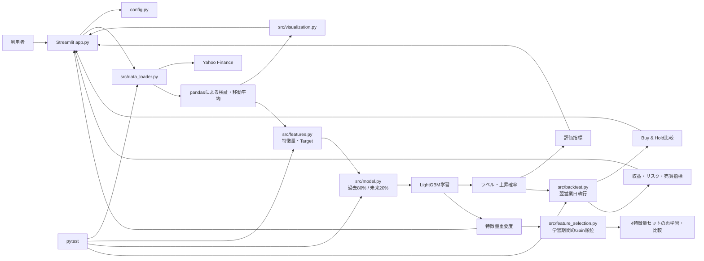

# System Design

## システムの目的

株価の取得から可視化、将来の機械学習評価までを一つのWebアプリとして構築し、個人開発の設計・実装・検証過程を説明可能にする。

## 想定利用者

- 株価データ分析を学ぶ本人
- ポートフォリオを確認する採用担当者・エンジニア

投資助言を求める利用者向けのサービスではない。

## 第1段階の機能

- トヨタ自動車（7203.T）の過去1年の日足取得
- 取得データの形式、空データ、必須列の検証
- 終値、20日・50日移動平均線の計算
- Plotlyグラフ、件数、期間、取得状態のStreamlit表示
- 通信に依存しないデータ処理テスト

## 現在実装済みの分析機能

未来情報を含まない特徴量、翌営業日の方向を表すTarget、過去80%・未来20%の時系列分割、LightGBMによる分類と上昇確率、5種類の評価指標、特徴量重要度を実装済みとする。さらに、確率閾値を使った翌営業日執行バックテストとBuy & Hold比較を実装し、Streamlitから入力・実行・結果表示できる。

## システム構成

## データ取得からグラフ表示までの流れ

1. `app.py` が設定値を読み込む。
2. `fetch_stock_data` がyfinanceへ日足データを要求する。
3. 列構造を統一し、空データと必須列を検証する。
4. 終値から20日・50日移動平均を過去方向のrolling計算で追加する。
5. Plotly Figureを生成し、Streamlitへ件数・日付範囲とともに表示する。
6. 失敗時はログへ原因を残し、画面へ再試行可能なメッセージを表示する。

## 学習データから評価までの流れ

1. `features.py` が当日までの株価・出来高から20特徴量を作る。
2. 翌営業日の終値との比較はTarget作成だけに使用する。
3. 特徴量とTargetがそろった行だけを学習用DataFrameとして残す。
4. `model.py` がFEATURE_COLUMNSとTargetを分離し、日付昇順へ並べる。
5. 先頭80%を学習期間、末尾20%をテスト期間として連続的に分割する。
6. 学習期間だけでLightGBMを学習し、テスト期間のラベルと上昇確率を予測する。
7. Accuracy、Precision、Recall、F1、ROC-AUCを計算する。
8. 全特徴量について、損失関数の改善量を表すGain Importanceと、木の分岐に使われた回数を表すSplit Importanceを取得する。
9. Gain Importanceの降順、同値時は特徴量名の昇順で整形し、それぞれの構成比を計算する。

## テクニカル指標の計算方針

- RSI: 14日。最初の14個の上昇幅・下落幅を算術平均で初期化し、以降は`((前日の平均 × 13) + 当日の値) / 14`で再帰更新する厳密なWilder方式を採用する。値動きがない場合は中立値50とする。
- MACD: EMA12 - EMA26。SignalはMACDの9日EMA、HistogramはMACD - Signalとする。EMAは`adjust=False`で計算する。
- Bollinger Bands: Middleは既存のMA20、標準偏差は20日母標準偏差（`ddof=0`）、Upper / LowerはMA20 ± 2σとする。
- Band Width: (Upper - Lower) / MA20。%B: (Close - Lower) / (Upper - Lower)。バンド幅が0の場合の%Bは中立値0.5とする。

すべてのrollingは当日を含む過去方向だけで計算し、`center=True`を使用しない。EMAも過去から当日までを再帰的に平滑する。計算期間に満たない先頭行はNaNとし、既存方針どおり全モデル特徴量とTargetがそろった行だけを学習対象にする。

モデル処理の結果はStreamlit UIへ渡し、件数・期間、分類指標、特徴量重要度として表示する。特徴量重要度はGainとSplitを切り替えられるグラフ、全特徴量の表、Gain上位5件、重要度0件数として確認できる。

特徴量重要度はモデルが学習期間内で特徴量をどのように利用したかを表し、因果関係を示すものではない。相関した特徴量がある場合は重要度が複数列へ分散する可能性がある。したがって、単一の学習期間の重要度だけで特徴量の採用・削除を判断せず、複数銘柄・複数期間や予測・バックテスト指標を含めて検証する。

## 特徴量セット比較実験の流れ

1. 全20特徴量とTargetを一度だけ時系列分割し、全セットで同じ学習・テスト期間を固定する。
2. Targetは翌営業日の終値から作るため、学習末尾ラベルがテスト初日の価格を参照する境界サンプル1件を除外する。テスト期間は変更しない。
3. パージ後の全特徴量学習期間だけでランキング用LightGBMを学習し、Gain Importance順位を決める。
4. All 20、Gain上位15、Gain上位10、Phase 8以前のBaseline 9を特徴量セットとして固定する。
5. 各セットを共通のパージ済み学習期間へ適用して個別に再学習し、順位決定後に同じテスト期間へ適用する。
6. 同じBuy Thresholdと、テスト末尾予測の翌取引日までに制限した終値でバックテストし、分類・収益・リスク指標を比較表へまとめる。

順位決定時にテスト特徴量、テストTarget、テスト初日の価格から作られる境界Target、将来リターンを参照しない。ランキング用モデルは順位作成だけに使い、その予測を評価へ流用しない。この実験はStreamlit UIへ統合せず、再現可能な実験コードとして分離する。

## ウォークフォワード検証の流れ

1. `walk_forward.py`が日付昇順のデータからexpanding window Foldを作る。
2. Fold 1は先頭100件、以降は既定で20件ずつ学習窓を拡張し、各Foldの直後20件をテストにする。不完全な末尾Foldは使用しない。
3. 各Foldの分割直後に学習末尾1件をパージし、翌営業日Targetがテスト初日の価格を参照しないようにする。
4. パージ済み学習データだけでFold固有のGain順位を計算し、Top 15 / Top 10を毎回選び直す。
5. All 20 / Top 15 / Top 10 / Baseline 9を同じパージ済みtrainと同じtestへ適用する。
6. バックテスト価格はFoldの最初の予測日から最後の予測日の翌取引日までに制限する。
7. Fold別の分類・バックテスト結果を作り、特徴量セットごとの平均、標本標準偏差、プラスリターンFold数を集約する。

後のFoldが過去Foldのテスト期間を学習へ取り込むことはexpanding windowの仕様として許可するが、そのFoldのテスト開始日以降は学習・順位決定へ含めない。ウォークフォワード実験はStreamlitへ統合せず、通信非依存テストと独立した実験記録で管理する。

## Streamlit画面の処理フロー

1. 利用者が銘柄コード、取得期間、Buy閾値を入力する。
2. 「分析開始」押下後、株価取得、特徴量作成、モデル学習、バックテストを順番に実行する。
3. 各段階をspinnerで示し、失敗した段階に応じた原因と確認事項を画面表示する。
4. 学習・テスト期間、モデル評価、バックテスト指標をmetricとして表示する。
5. 株価と移動平均、Gain / Split特徴量重要度、累積リターン比較をPlotlyで表示する。
6. 特徴量重要度はタブ切り替えグラフ、一覧表、Gain上位5件、Gain・Splitそれぞれの重要度が0の件数を表示する。

## 予測からバックテストまでの流れ

1. `model.py` がテスト期間について上昇クラス1の予測確率を返す。
2. `backtest.py` が確率0.55以上をBuy、未満をCashと判断する。
3. 最初の予測日から終値データ最終日まで、省略のない取引日カレンダーを作る。
4. 判断日と同日には売買せず、価格データ上の翌営業日へシグナルを割り当てる。
5. 新しいシグナルが執行されるまでは直前のポジションを維持する。最初の執行前はCashとし、未来方向からの補完は行わない。
6. 各営業日の有効ポジションを同日の終値リターンへ適用する。ショートは行わず、Cashの日はリターン0とする。
7. 完全に同じ取引日カレンダーのBuy & Holdをベンチマークとして計算する。
8. 戦略とベンチマークの累積リターンを複利計算する。
9. 年率リターン、年率ボラティリティ、Sharpe Ratio、最大ドローダウン、勝率、平均利益・損失、取引回数を集計する。

Total TradesはCashからBuyへ切り替わった回数とする。Win RateはBuy保有日のうち日次リターンが正だった割合とする。現段階では取引手数料、税金、スリッページを考慮しない。

予測日インデックスの重複は、同じ執行日に複数判断が対応する曖昧さを避けるためValueErrorとする。非連続予測は許可し、`ffill`で過去の確定ポジションだけを将来へ維持する。`bfill`は使用しない。

## 各ファイルの役割

| ファイル | 役割 |
|---|---|
| `app.py` | 入力UI、分析パイプライン呼び出し、結果配置、段階別例外表示 |
| `config.py` | 銘柄、期間、移動平均日数 |
| `src/constants.py` | 列名、固定文言 |
| `src/utils.py` | 共通の入力検証 |
| `src/data_loader.py` | yfinance取得、検証、整形、移動平均 |
| `src/visualization.py` | 株価、特徴量重要度、累積リターンのPlotlyグラフ生成 |
| `src/features.py` | 過去情報による特徴量、Target、学習用データ |
| `src/model.py` | 時系列分割、LightGBM学習、予測、評価、特徴量重要度 |
| `src/feature_selection.py` | 学習期間のGain順位、特徴量セット再学習、分類・バックテスト比較 |
| `src/walk_forward.py` | expanding window Fold作成、Fold別評価、平均・標準偏差集約 |
| `src/backtest.py` | 翌営業日執行、Buy & Hold比較、バックテスト指標 |
| `tests/` | 通信非依存の自動テスト |

## 使用技術を選んだ理由

- Python / pandas / NumPy: データ分析の学習資源が豊富で、表形式データを扱いやすい。
- yfinance: APIキーなしで学習用の株価データを取得できる。
- Plotly: 拡大・ホバー可能な対話的グラフを作れる。
- Streamlit: Python中心の小規模データアプリを短いコードで公開できる。
- pytest: 小さな関数単位の再現可能なテストを記述しやすい。
- scikit-learn: 分類評価指標を一貫したAPIで安全に計算できる。
- LightGBM: 表形式データの非線形な関係を扱え、特徴量重要度も取得できる。

## 未来情報の混入を防ぐ方針

移動平均、RSI、MACD、Bollinger Bandsなどの特徴量は当日を含む過去データだけで計算する。将来の目的変数は翌営業日の終値との比較だけに使用し、特徴量には混ぜない。分割前に日付昇順へ並べ、過去を学習、未来をテストにする。ランダム分割は未来相場を過去の学習へ混ぜるため使用しない。現段階では標準化などの前処理は行わない。将来追加する場合も、学習期間だけで適合させる。

## エラー処理の方針

入力、通信、空データ、列不足を処理層で検出して原因を保持した `StockDataError` に変換する。UI層では想定例外を具体的に表示し、予期しない例外は詳細をログに残しつつ機密情報を画面へ出さない。エラーを握りつぶさず、アプリ全体は停止させない。

## セキュリティ・運用上の注意点

APIキーは使用しない。将来秘密情報が必要になった場合は環境変数またはStreamlit Secretsを使用する。Yahoo Financeへの過剰なアクセスを避けるため1時間キャッシュし、取得元の利用条件とデータ品質に注意する。

## 今後の拡張方針

ウォークフォワード検証、手数料を含むバックテスト、結果ダウンロードを段階的に追加する。各段階でテストと開発ログを更新し、公開前に依存関係・表示・免責事項を再確認する。
