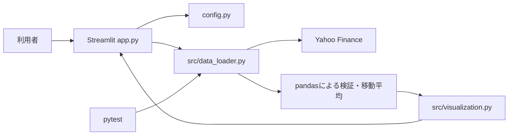

# System Design

## システムの目的

株価の取得から可視化、将来の機械学習評価までを一つのWebアプリとして構築し、個人開発の設計・実装・検証過程を説明可能にする。

## 想定利用者

- 株価データ分析を学ぶ本人
- ポートフォリオを確認する採用担当者・エンジニア

投資助言を求める利用者向けのサービスではない。

## 第1段階の機能

- トヨタ自動車（7203.T）の過去1年の日足取得
- 取得データの形式、空データ、必須列の検証
- 終値、20日・50日移動平均線の計算
- Plotlyグラフ、件数、期間、取得状態のStreamlit表示
- 通信に依存しないデータ処理テスト

## 最終的に実装予定の機能

未来情報を含まない特徴量、LightGBMによる翌営業日の方向予測、時系列評価、特徴量重要度、手数料を含むバックテスト、単純保有との比較を実装予定とする。

## システム構成

## データ取得からグラフ表示までの流れ

1. `app.py` が設定値を読み込む。
2. `fetch_stock_data` がyfinanceへ日足データを要求する。
3. 列構造を統一し、空データと必須列を検証する。
4. 終値から20日・50日移動平均を過去方向のrolling計算で追加する。
5. Plotly Figureを生成し、Streamlitへ件数・日付範囲とともに表示する。
6. 失敗時はログへ原因を残し、画面へ再試行可能なメッセージを表示する。

## 各ファイルの役割

| ファイル | 役割 |
|---|---|
| `app.py` | UI、処理呼び出し、利用者向け例外表示 |
| `config.py` | 銘柄、期間、移動平均日数 |
| `src/constants.py` | 列名、固定文言 |
| `src/utils.py` | 共通の入力検証 |
| `src/data_loader.py` | yfinance取得、検証、整形、移動平均 |
| `src/visualization.py` | Plotlyグラフ生成 |
| `src/features.py` | 特徴量作成（今後実装予定） |
| `src/model.py` | 時系列分割とモデル（今後実装予定） |
| `src/backtest.py` | 売買検証（今後実装予定） |
| `tests/` | 通信非依存の自動テスト |

## 使用技術を選んだ理由

- Python / pandas / NumPy: データ分析の学習資源が豊富で、表形式データを扱いやすい。
- yfinance: APIキーなしで学習用の株価データを取得できる。
- Plotly: 拡大・ホバー可能な対話的グラフを作れる。
- Streamlit: Python中心の小規模データアプリを短いコードで公開できる。
- pytest: 小さな関数単位の再現可能なテストを記述しやすい。

## 未来情報の混入を防ぐ方針

第1段階の移動平均は当日を含む過去データだけで計算する。将来の目的変数は翌営業日の終値との比較だけに使用し、特徴量には混ぜない。学習・テストは日付順とし、前処理は学習期間だけで適合させる。この方針は第2段階以降のテストでも検証する。

## エラー処理の方針

入力、通信、空データ、列不足を処理層で検出して原因を保持した `StockDataError` に変換する。UI層では想定例外を具体的に表示し、予期しない例外は詳細をログに残しつつ機密情報を画面へ出さない。エラーを握りつぶさず、アプリ全体は停止させない。

## セキュリティ・運用上の注意点

APIキーは使用しない。将来秘密情報が必要になった場合は環境変数またはStreamlit Secretsを使用する。Yahoo Financeへの過剰なアクセスを避けるため1時間キャッシュし、取得元の利用条件とデータ品質に注意する。

## 今後の拡張方針

特徴量作成、時系列評価、モデル、バックテストをそれぞれ独立モジュールとして段階的に追加する。各段階でテストと開発ログを更新し、公開前に依存関係・表示・免責事項を再確認する。
